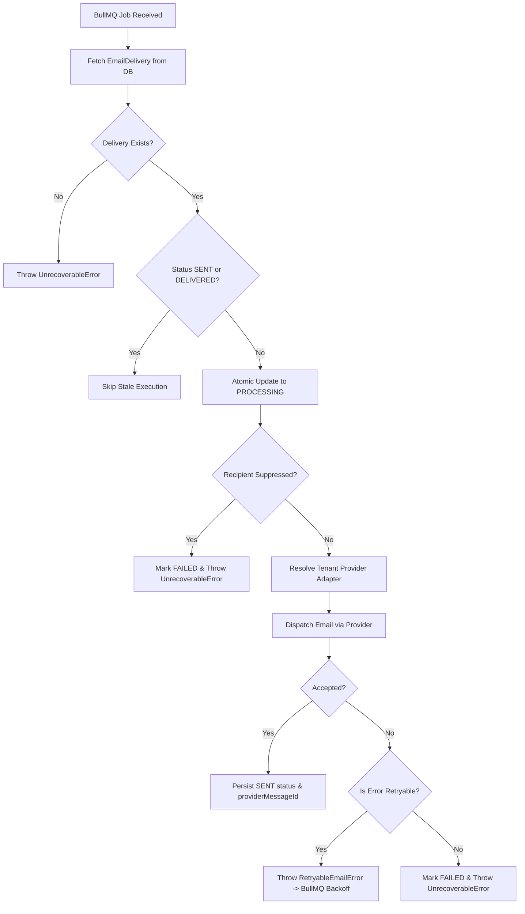

# Asynchronous Email Queue Architecture (BullMQ + Redis)

## 1. Overview & Architectural Boundaries

Phase 4 introduces an asynchronous queueing and processing layer for email dispatch using **BullMQ** backed by **Redis**.

### Core Boundaries & Separation of Concerns
1. **WhatsApp Messages are Untouched**: The existing WhatsApp PostgreSQL durable queue (`WebhookDelivery`, `Message`, `MessageEvent`) remains authoritative for WhatsApp traffic. It is **NOT** migrated to BullMQ.
2. **Serverless Producer vs. Dedicated Worker**:
   - **Next.js on Netlify** acts strictly as a **Queue Producer** (enqueuing jobs, writing authoritative DB state).
   - Netlify serverless functions **MUST NOT** run persistent BullMQ `Worker` loops.
   - A dedicated Node.js runtime process (`workers/email-worker.ts`) executes as a long-running daemon (e.g., Docker, ECS, Fly.io, Render, Kubernetes, or VM).

---

## 2. Queue Topology & Job Contracts

Three dedicated queues segregate workloads to prevent bulk campaign operations from starving time-sensitive transactional emails:

| Queue Name | Job Name | Primary Identifier | Purpose | Default Retries & Backoff |
|---|---|---|---|---|
| `email-transactional` | `send-transactional` | `deliveryId` | Password reset, OTP, verification, system alerts | 3 attempts, exponential backoff (2s, 4s, 8s) |
| `email-campaign` | `send-campaign-recipient` | `campaignRecipientId` | Scheduled promotional messages to segments | 3 attempts, exponential backoff (5s, 10s, 20s) |
| `email-events` | `process-email-event` | `eventId` | Asynchronous webhook tracking (bounces, opens) | 5 attempts, fixed backoff (3s) |

### Job Payload Schema
To prevent Redis memory bloat and stale data issues, BullMQ jobs store **authoritative identifiers** rather than whole database records:
```typescript
interface TransactionalJobData {
  deliveryId: string;    // Foreign key to PostgreSQL EmailDelivery table
  clientId: string;      // Tenant ID
  category: "TRANSACTIONAL";
  attempt?: number;
}
```

---

## 3. Business Idempotency & Queue-Level Deduplication

BullMQ enforces custom queue-scoped `jobId` deduplication. We construct stable, business-level identifiers:
- **Transactional Job ID**: `email-transactional-${deliveryId}`
- **Campaign Job ID**: `email-campaign-${campaignRecipientId}`
- **Event Job ID**: `email-event-${eventId}`

If a network glitch or duplicate API trigger attempts to re-enqueue an identical delivery, BullMQ rejects the duplicate job insertion.

### Database-First Enqueueing Sequence
1. Validate request and parameters.
2. Verify suppression list (drop permanently suppressed recipients before touching Redis).
3. Persist authoritative database record in PostgreSQL (`EmailDelivery` with `status: QUEUED`).
4. Enqueue BullMQ job with custom `jobId`.
5. Return normalized queued state.

---

## 4. Worker Architecture & Execution Flow

The dedicated worker process (`workers/email-worker.ts`) executes the following authoritative sequence:



### Stale Delivery Guard
If a job is re-delivered after an earlier execution has already transitioned the delivery record to `SENT` or `DELIVERED`, the worker logs an audit warning and skips dispatch to prevent duplicate emails to customers.

---

## 5. Error Classification Policy

Errors are strictly segregated into two categories:

### A. Retryable (Transient) Errors
Trigger BullMQ exponential backoff retries:
- HTTP 429 (Rate Limit Exceeded)
- HTTP 502 / 503 / 504 (Provider Service Unavailable / Gateway Timeout)
- TCP network errors (`ECONNRESET`, `ETIMEDOUT`, `ENOTFOUND`)
- Socket timeout during MIME transmission

### B. Permanent (Unrecoverable) Errors
Immediately fail the job and record final `FAILED` status in PostgreSQL (never retried endlessly):
- `RECIPIENT_SUPPRESSED`: Recipient is on unsubscribe or hard-bounce suppression list.
- `INVALID_EMAIL`: RFC 5322 structure violation.
- `PROVIDER_RESOLUTION_FAILED`: Tenant has no active provider configuration.
- `AUTHENTICATION_FAILED`: OAuth credentials permanently revoked or rejected by Google.
- `INVALID_REQUEST`: 400 Bad Request returned by provider.

---

## 6. Local Development Setup

To run Redis locally for development:

### Option A: Docker (Recommended)
```bash
docker run -d --name whatsapp-hub-redis -p 6379:6379 redis:7-alpine
```

### Option B: Local Redis Server
```bash
redis-server
```

### Environment Configuration
Add to `.env` or `.env.local`:
```env
REDIS_URL="redis://127.0.0.1:6379"
EMAIL_WORKER_CONCURRENCY="5"
EMAIL_QUEUE_MAX_RATE="15"
EMAIL_QUEUE_MAX_ATTEMPTS="3"
EMAIL_QUEUE_BACKOFF_MS="2000"
```

To run the background email worker locally in parallel with Next.js:
```bash
npm run worker:email
```

---

## 7. Production Deployment Requirements

### Critical Netlify Deployment Constraint
> [!WARNING]
> Netlify serverless/edge functions have strict execution timeouts (10s to 26s). They freeze and terminate background threads immediately upon returning an HTTP response. **Do not attempt to run `createEmailWorker()` inside Netlify API handlers.**

### Production Topology
1. **Next.js Web / API App** (Hosted on Netlify or Vercel):
   - Handles HTTP endpoints, auth, admin dashboard, and webhook ingestion.
   - Enqueues jobs to Redis via `queueTransactionalEmail`.
2. **Managed Redis Cluster**:
   - Upstash Redis, AWS ElastiCache, or Redis Cloud.
   - Connection string configured via `REDIS_URL`.
3. **Dedicated Worker Container**:
   - Runs `npm run worker:email` (`tsx workers/email-worker.ts` or compiled Node).
   - Hosted on a persistent container platform (AWS ECS Fargate, Render, Fly.io, Railway, Kubernetes, or VM).
   - Handles graceful SIGTERM / SIGINT shutdown with in-flight job drain.
