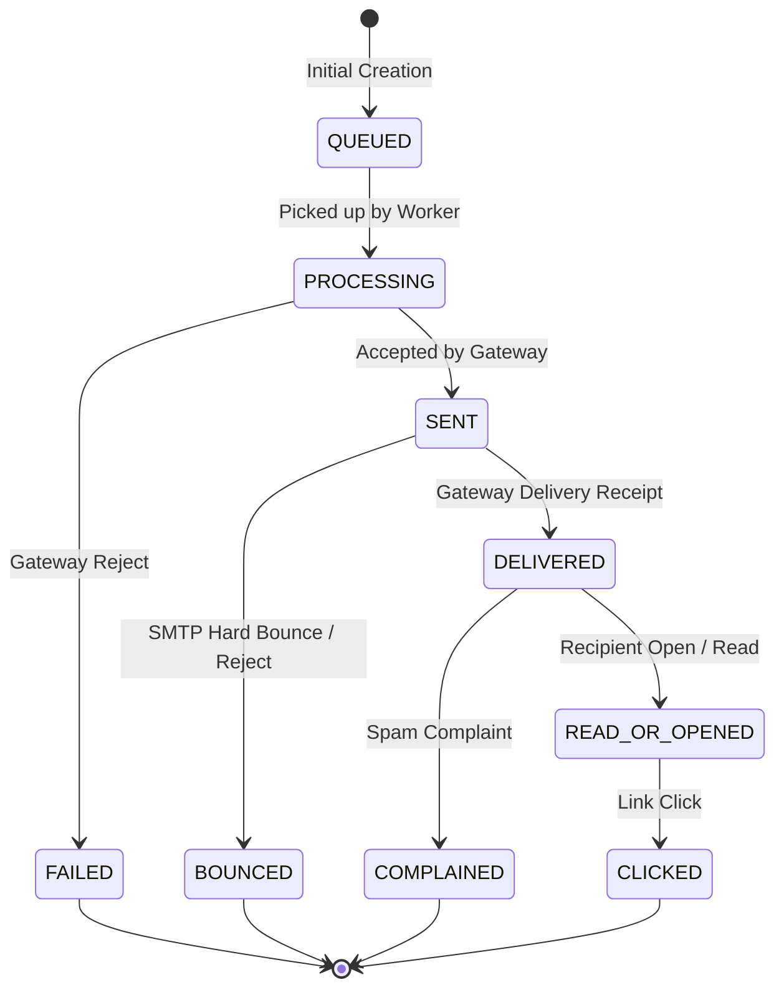
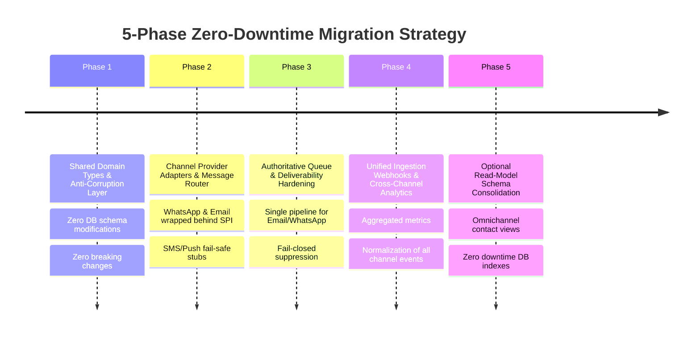

# Unified Multi-Channel Communication Architecture & Migration Strategy

## Executive Overview
This document defines the architectural specification, design patterns, lifecycle state machines, cross-channel contracts, and the phased non-breaking migration strategy for transitioning from channel-siloed messaging to a unified omnichannel communication platform.

### Core Architecture Principles
1. **Zero Premature Schema Merging**: Channel-specific storage models (`Message` / `MessageEvent` for WhatsApp; `EmailContact` / `EmailDelivery` / `EmailEvent` / `EmailCampaign` for Email) remain isolated in PostgreSQL. We strictly reject polymorphic column dumping and table coalescing that would sacrifice referential integrity, indexes, or tenant isolation.
2. **Anti-Corruption Layer (ACL)**: Unification occurs above the persistence layer via strongly-typed domain contracts, monotonic lifecycle adapters, and the `ChannelProviderAdapter` Service Provider Interface (SPI).
3. **Strict Backward Compatibility**: Existing WhatsApp APIs, webhooks, and services (`MessageService`, `/api/webhooks/whatsapp`) and Email delivery pipelines (`EmailService`, BullMQ queues, worker processors) remain 100% backward compatible without interface drift or signature breaks.
4. **Deterministic Fail-Closed Security**: Suppression verification, tenant boundary validation, and webhook signature verification strictly fail closed. Promotional dispatches are blocked if suppression state cannot be conclusively confirmed.
5. **No Fake Upstream Successes**: Future adapters (SMS, Push) strictly return `PROVIDER_UNAVAILABLE` until production upstream gateways and credentials are bound.

---

## The 10 Shared Domain Concepts

The platform establishes 10 canonical abstractions in `src/lib/communication/types.ts`:

| # | Concept | Unified Interface | Channel Implementations & Mappings |
|---|---|---|---|
| 1 | **Contact** | `UnifiedContact` | WhatsApp: E.164 phone number, chat contact profile. Email: `EmailContact` (email, name, subscription status, consent). SMS: E.164 normalized destination. Push: Device registration token, OS type. |
| 2 | **Message** | `UnifiedMessageRequest` | Standardized envelope containing sender, recipient, content variants (text, template, rich media), delivery options, idempotency keys, and tenant ID. |
| 3 | **Campaign** | `UnifiedCampaign` | Encapsulates audience targeting, recurrence intervals, DAG automation steps, execution counters, and campaign state machines. |
| 4 | **Template** | `UnifiedTemplate` | Multi-channel template definitions with channel-specific rendering targets (WhatsApp Cloud API template components vs. Email HTML/CSS/text vs. SMS text). |
| 5 | **Delivery** | `UnifiedDeliveryRecord` | Monotonic state tracking record capturing provider references, attempt counts, timestamps, error diagnostics, and terminal delivery status. |
| 6 | **Event** | `UnifiedNormalizedEvent` | Canonical telemetry event representation (`QUEUED`, `SENT`, `DELIVERED`, `READ_OR_OPENED`, `CLICKED`, `FAILED`, `BOUNCED`, `COMPLAINED`, `UNSUBSCRIBED`). |
| 7 | **Suppression** | `UnifiedSuppression` | Multi-channel suppression record indexed by destination (email or E.164 phone) across reasons (`HARD_BOUNCE`, `COMPLAINT`, `UNSUBSCRIBE`, `MANUAL`). |
| 8 | **Consent** | `UnifiedConsent` | Legal consent tracking with opt-in status (`OPTED_IN`, `OPTED_OUT`, `EXPLICIT_DOUBLE_OPT_IN`), source, timestamp, and audit trail. |
| 9 | **Provider** | `UnifiedProviderHealthResult` | Provider abstraction defining credentials, latency health checks, rate limits, and capabilities (`supportsTemplates`, `supportsMedia`, `supportsTwoWay`). |
| 10 | **Analytics** | `UnifiedAnalyticsSummary` | Normalized performance counters, deliverability rates, engagement rates, and error categorizations across channels and tenants. |

---

## Monotonic Delivery Lifecycle State Machine

To prevent out-of-order webhook delivery from overwriting advanced terminal states with stale events, every channel adheres to a monotonic precedence matrix:

### Precedence Matrix & Transition Invariants
- `QUEUED` (0) $\to$ `PROCESSING` (1) $\to$ `SENT` (2) $\to$ `DELIVERED` (3) $\to$ `READ_OR_OPENED` (4) $\to$ `CLICKED` (5).
- Terminal failure states (`FAILED`, `BOUNCED`, `COMPLAINED`) have precedence 4+.
- Terminal states can never transition backward to `QUEUED`, `PROCESSING`, or `SENT`.
- `DELIVERED` can never be superseded by late generic `FAILED` or late `BOUNCED`.
- `COMPLAINED` can legally succeed `DELIVERED` (representing user spam complaint after inbox receipt).

---

## Campaign Automation & Journey Engine

Built on top of the existing PostgreSQL and BullMQ foundations without introducing a second campaign engine:

### DAG Workflow Step Types
1. `SEND_CAMPAIGN`: Dispatches campaigns or single-recipient child campaigns via `executeSendCampaignStep`, ensuring later enrollments are never skipped by campaign worker completion.
2. `DELAY`: Pauses execution for a positive duration (`delayMinutes`, `delayHours`, `delayDays`), scheduling BullMQ delayed jobs with mandatory continuation paths.
3. `CONDITIONAL_BRANCH`: Evaluates contact attributes, tags, custom fields, and previous step outcomes to route contacts to `trueNextStepId` or `falseNextStepId`.
4. `WAIT_FOR_EVENT`: Listens for recipient interactions (`OPENED`, `CLICKED`, `REPLIED`, etc.). Enforces timeout semantics: if the event arrives before timeout, advances to `nextStepId`; if timeout expires, branches to `timeoutNextStepId` or transitions to `ABANDONED` (`TIMEOUT_EXPIRED`). Never enters infinite timeout loops.
5. `END`: Formally concludes journey execution, transitioning enrollment to `COMPLETED`.

### Workflow Graph Validation Rules
- **Unique Step Identifiers**: Every node must have a unique non-empty `id`.
- **Dangling Reference Prevention**: Every edge target must resolve to a defined step in the workflow graph.
- **Cycle Detection**: 3-color Depth-First Search (`UNVISITED`, `VISITING`, `VISITED`) proves the graph is a Directed Acyclic Graph (DAG) and reports the exact cycle chain upon detection.
- **Bounded Depth**: Workflow execution depth is strictly limited to 50 steps.
- **Reachability**: All nodes must be reachable from the root step.
- **Terminal Path**: At least one path must reach a valid terminal step.

### Audience Re-evaluation & Self-Trigger Prevention
- **Re-evaluation Policies**: `ALWAYS_RE_EVALUATE`, `RE_EVALUATE_ON_STEP`, `NEVER_RE_EVALUATE`. Contacts failing segment filters or losing marketing consent are immediately abandoned with `CRITERIA_MISMATCH` or `UNSUBSCRIBED`.
- **Strict Self-Trigger Prevention**: If an event originated from a child campaign belonging to an automation, that automation is prohibited from re-enrolling the contact from its own output.
- **Re-entry Policy**: By default, contacts that complete or abandon cannot re-enroll. Re-entry requires explicit `allowReentry: true` configuration and compliance with the cooldown period (minimum 60 minutes).

---

## Phased Non-Breaking Migration Strategy

### Phase 1: Shared Domain Abstractions (Completed)
- Deploy `src/lib/communication/types.ts`, `lifecycle.ts`, `tenant.ts`, `analytics.ts`.
- Zero database mutations.
- WhatsApp and Email existing database schemas and code remain 100% untouched.

### Phase 2: Channel Adapters & Unified Router (Completed)
- Implement `ChannelProviderAdapter` SPI.
- Deploy `WhatsAppChannelAdapter` wrapping `MessageService` with 100% backward compatibility.
- Deploy `EmailChannelAdapter` delegating to `EmailService` and template engine.
- Deploy `SmsChannelAdapter` and `PushChannelAdapter` returning explicit `PROVIDER_UNAVAILABLE` until production gateways are provisioned.
- Deploy `UnifiedMessageRouter` with multi-tenant boundaries and fail-closed suppression verification.

### Phase 3: Authoritative Pipeline & Automation Hardening (Completed)
- Eliminate duplicate email dispatch pathways by routing through authoritative `EmailDelivery` persistence and BullMQ queues.
- Implement child campaign isolation per enrollment execution in `EmailAutomationService`.
- Implement timeout resolution and DAG cycle validation.
- Protect webhooks with provider-level authentication and HMAC/PubSub signature verification.

### Phase 4: Omnichannel Event Telemetry & Cross-Channel Reporting
- Ingest WhatsApp and Email webhook events into normalized domain contracts.
- Aggregate deliverability and engagement counters across channels per tenant.
- Provide unified analytics endpoints reporting delivery rate, open/read rate, click rate, and bounce rate.

### Phase 5: Optional Read-Model Schema Optimization (Future)
- Introduce read-only PostgreSQL views or auxiliary query projections joining WhatsApp and Email contacts by phone/email hash.
- Maintain independent source-of-truth tables (`Message` and `EmailDelivery`) permanently to preserve high-throughput partitioning, channel-specific indexes, and zero-risk isolation.
