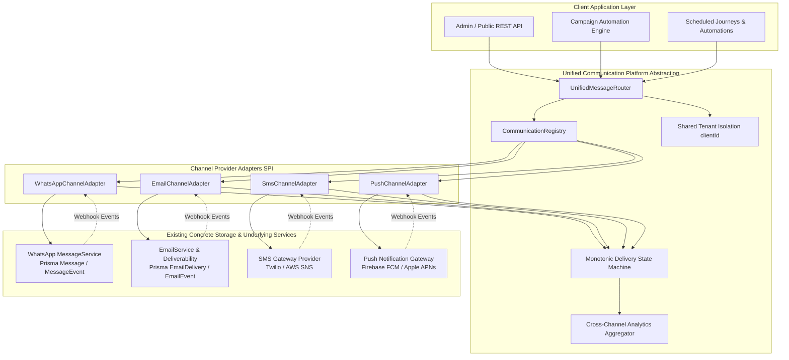
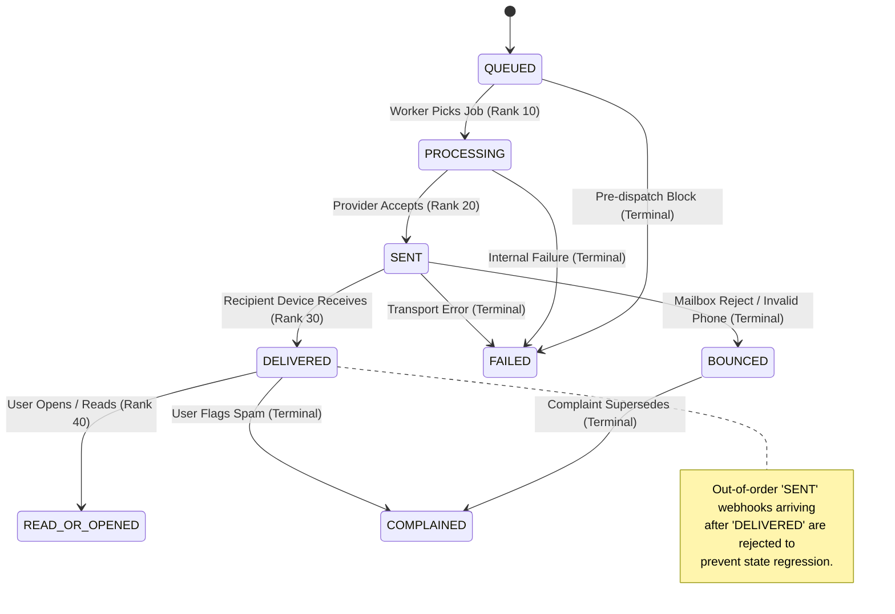
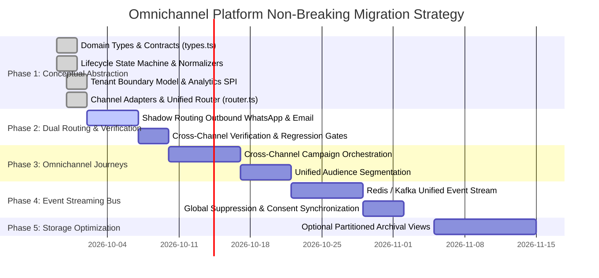

# Unified Multi-Channel Communication Platform Architecture

**Document Version:** 1.0.0  
**Status:** Approved Architectural Blueprint  
**Target Systems:** WhatsApp (Meta Cloud API), Email (Gmail / ESP Engine), Future SMS, Future Push Notifications  

---

## 1. Executive Summary & Architectural Paradigm

Modern communication platforms require seamless engagement across multiple direct-to-consumer and business-to-business messaging channels. However, attempting to prematurely merge heterogeneous communication channels (such as WhatsApp, Email, SMS, and Push) into a single polymorphic database table causes severe architectural problems:
- **Polymorphic Column Bloat & Nullability Epidemic:** Email requires RFC 5322 headers, DKIM/SPF domain verification, HTML bodies, and MIME multipart payloads; WhatsApp requires Meta Cloud API template namespaces, button indexes, and component parameters; SMS requires character encoding segments (GSM-7 vs. UCS-2); Push requires APNs collapse IDs and FCM device registration tokens. Merging them into a single table degrades indexing, increases row size, and removes relational foreign key constraints.
- **Downtime and Regression Risk:** Altering production tables (`Message`, `EmailDelivery`, `EmailContact`) risks breaking live customer-facing messaging and marketing automations.

### Architectural Solution: Domain-Driven Design & Anti-Corruption Layer (ACL)
Instead of premature database unification, this architecture decouples the **conceptual domain layer** from the **concrete storage layer**:
1. **Unified Domain Layer:** Exposes channel-agnostic contracts for 10 shared concepts: Contact, Message, Campaign, Template, Delivery, Event, Suppression, Consent, Provider, and Analytics.
2. **Channel-Specific Services:** Retain optimized, dedicated services (`MessageService`, `EmailService`, `EmailEventService`, `EmailAutomationService`).
3. **Provider-Specific Adapters:** Pluggable adapters implementing the `ChannelProviderAdapter` Service Provider Interface (SPI).
4. **Anti-Corruption Layer (ACL):** Normalizes incoming vendor webhooks (Meta, Google, Resend, Twilio, Apple APNs) into standardized domain events without altering underlying storage.
5. **Shared Lifecycle & Tenant Models:** Enforces strict monotonic delivery state transitions and multi-tenant isolation (`clientId`) across all channels.



---

## 2. The 10 Shared Conceptual Domain Models

The architecture formalizes 10 core concepts shared across all current and future channels:

### 2.1 Contact (`UnifiedContact`)
An omnichannel entity representing a person or subscriber reachable across one or more communication channels.
- **Reachability Map:** Maps destination channels (`WHATSAPP`, `EMAIL`, `SMS`, `PUSH`) with verification status (`verified: boolean`), opt-in status (`OPTED_IN`, `OPTED_OUT`, `PENDING`), and channel-specific handles.
- **Data Model Boundary:** Maintains links to concrete records (`EmailContact`, WhatsApp phone directory) without forcing physical table unification.

### 2.2 Message (`UnifiedMessageRequest`, `UnifiedSendResult`)
The channel-agnostic envelope for outbound message dispatch.
- **Tenant Context:** Strict `clientId` requirement.
- **Message Category:** `TRANSACTIONAL`, `PROMOTIONAL`, `UTILITY`, `AUTHENTICATION`.
- **Channel Variants:** Polymorphic content payload (rich HTML, plain text, Meta HSM template name and parameters, SMS body, Push notification payload).
- **Idempotency:** Client-supplied idempotency key scoped strictly to `clientId`.

### 2.3 Campaign (`UnifiedCampaign`)
Cross-channel broadcast and marketing journey coordination.
- **Lifecycle Statuses:** `DRAFT` $\to$ `SCHEDULED` $\to$ `RUNNING` $\to$ `PAUSED` $\to$ `COMPLETED` / `FAILED` / `CANCELLED`.
- **Target Channels:** Dispatches across WhatsApp, Email, SMS, or Push.
- **Audience Criteria:** Dynamic segments, static lists, or event triggers.

### 2.4 Template (`UnifiedTemplate`)
A single logical communication template containing channel-specific rendering variants:
- **WhatsApp Variant:** Template name, language code (e.g. `en_US`), and parameter components.
- **Email Variant:** Subject line, HTML body, plain text alternative, and variable interpolation syntax (`{{firstName}}`).
- **SMS Variant:** 160-character segmented plain text with mandatory opt-out instructions (`Reply STOP`).
- **Push Variant:** Title, subtitle, body, badge count, and custom JSON data payload.

### 2.5 Delivery (`UnifiedDeliveryRecord`)
Represents an individual transmission attempt to a specific recipient address/token.
- **Lifecycle Tracking:** Monotonic tracking (`QUEUED` $\to$ `PROCESSING` $\to$ `SENT` $\to$ `DELIVERED` $\to$ `READ_OR_OPENED`).
- **Failure Classification:** `UnifiedFailureCategory` (`INVALID_DESTINATION`, `RATE_LIMITED`, `PROVIDER_ERROR`, `OPTED_OUT_OR_SUPPRESSED`, etc.).

### 2.6 Event (`UnifiedNormalizedEvent`)
Authoritative telemetry stream capturing all channel interactions:
- Standardized event types: `QUEUED`, `SENT`, `DELIVERED`, `READ_OR_OPENED`, `CLICKED`, `FAILED`, `BOUNCED`, `COMPLAINT`, `OPT_OUT`.
- Canonical timestamp, recipient identity, provider event IDs, and payload metadata.

### 2.7 Suppression (`UnifiedSuppression`)
Cross-channel suppression registry preventing delivery to invalid or unwilling destinations:
- **Reasons:** `HARD_BOUNCE`, `COMPLAINT`, `UNSUBSCRIBED`, `USER_BLOCKED`, `INVALID_DESTINATION`, `MANUAL`.
- **Scope:** Channel-specific or global (`channel: "ALL"`).

### 2.8 Consent (`UnifiedConsent`)
Auditable opt-in / opt-out ledger supporting GDPR, TCPA, and Meta Business Policy compliance:
- Category-level consent: Subscribers can opt into `TRANSACTIONAL` (order updates) while opting out of `PROMOTIONAL` campaigns.
- Cryptographic proof, source tracking, and revocation timestamps.

### 2.9 Provider (`UnifiedProviderHealthResult`, `ChannelProviderAdapter`)
Decoupled transport adapter interface:
- Standardized health probing (`checkHealth()`), round-trip latency reporting, and capability negotiation (media support, templates, two-way messaging, read receipts, rate limits).

### 2.10 Analytics (`UnifiedRateMetrics`, `UnifiedAnalyticsSummary`)
Standardized performance metrics across all channels:
- $\text{deliveryRate} = \frac{\text{delivered}}{\text{sent}}$
- $\text{readOrOpenRate} = \frac{\text{readOrOpened}}{\text{delivered}}$
- $\text{clickThroughRate} = \frac{\text{clicked}}{\text{delivered}}$
- $\text{clickToOpenRate} = \frac{\text{clicked}}{\text{readOrOpened}}$
- $\text{bounceRate} = \frac{\text{bounced}}{\text{sent}}$
- $\text{complaintRate} = \frac{\text{complaints}}{\text{delivered}}$

---

## 3. Monotonic Delivery State Machine

Because webhooks from Meta, Gmail, Resend, SendGrid, and Twilio can arrive out-of-order or duplicate, the platform enforces a **strictly monotonic state progression**:



### Precedence Table

| Rank | Status | Monotonic Rules |
| :---: | :--- | :--- |
| **0** | `QUEUED` | Initial queued state |
| **10** | `PROCESSING` | Worker pickup; cannot regress to `QUEUED` |
| **20** | `SENT` | Upstream accepted; cannot regress to `PROCESSING` or `QUEUED` |
| **30** | `DELIVERED` | Handed off to destination device |
| **40** | `READ_OR_OPENED` | Confirmed user engagement |
| **90** | `FAILED` | Terminal transport failure; cannot regress |
| **95** | `BOUNCED` | Terminal destination reject; cannot regress |
| **100** | `COMPLAINED` | Terminal spam flag; supersedes all progressive states and soft failures |

---

## 4. Multi-Tenant Isolation Model

Tenant isolation is enforced as an uncompromisable security boundary:
1. **Mandatory Tenant Context:** All operations require a verified `clientId`.
2. **Horizontal Privilege Escalation Defense:** `assertTenantBoundary(entity, expectedClientId)` validates that every accessed record matches the caller's tenant.
3. **Channel Gating:** Tenants only access channels explicitly permitted in their tenant profile.

---

## 5. Phase-by-Phase Non-Breaking Migration Strategy



### Phase 1: Conceptual Abstraction & Anti-Corruption Layer (COMPLETED)
- Created shared contracts in `src/lib/communication/`: `types.ts`, `lifecycle.ts`, `tenant.ts`, `analytics.ts`, `adapters/`, `registry.ts`, `router.ts`.
- Zero database changes: WhatsApp uses `Message` / `MessageEvent`; Email uses `EmailDelivery` / `EmailEvent`.
- 100% backward compatibility certified with automated verification suite (`npm run test:communication`).

### Phase 2: Dual Routing & Verification (Ready to Roll Out)
- New features or internal services dispatch outbound communications through `UnifiedMessageRouter.route(request)`.
- Existing direct calls to `MessageService.send()` and `EmailService.send()` continue executing identically without disruption.
- Health checks monitor provider status across WhatsApp, Email, SMS, and Push.

### Phase 3: Omnichannel Journeys & Shared Campaigns
- The existing Campaign Engine executes multi-step journeys that switch or fallback across channels (e.g. attempt WhatsApp $\to$ fallback to SMS $\to$ send follow-up Email).
- Unified template resolver selects channel variants based on user preference.

### Phase 4: Unified Event Streaming Bus
- Publish all normalized events (`UnifiedNormalizedEvent`) to a Redis Stream or Kafka topic.
- Dedicated worker processes update cross-channel analytics, suppression lists, and engagement scores in real time.

### Phase 5: Optional Storage Optimization (Long-Term)
- If high-volume archival requires storage consolidation in the future, introduce database views or partitioned tables (`UnifiedDeliveryPartitioned`) with zero-downtime dual-writes.
- Deprecation of legacy tables only after 6 months of verified parallel operation.

---

## 6. Verification & Test Certification

The platform includes a dedicated end-to-end verification suite in `scripts/verify-unified-communication.ts`:
- **Test 1:** All 10 Shared Domain Concepts representation and typing.
- **Test 2:** Monotonic delivery status transitions and regression rejections.
- **Test 3:** Campaign lifecycle state machine transitions.
- **Test 4:** Multi-tenant boundary isolation and unauthorized access prevention.
- **Test 5:** Channel provider adapters SPI compliance for WhatsApp, Email, SMS, and Push.
- **Test 6:** Unified channel registry and diagnostic health probes.
- **Test 7:** Cross-channel analytics aggregation, zero-division defense, and bot scanner clamping.
- **Test 8:** Inbound status and event normalization across all channels.

To execute the verification suite:
```bash
npm run test:communication
```
